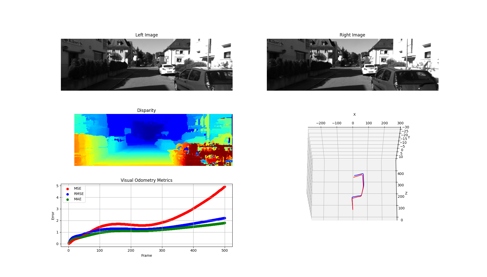

# Visual Odometry

This is a simple implementation of visual odometry using OpenCV and Python. The pipeline applies stereo depth estimation and multi-view geometry to track the camera pose over time. This repo implements the following features:
* Stereo depth estimation using Block Matching (BM) and Semi-Global Block Matching (SGBM)
* Feature detection and description using SIFT, SURF, ORB, etc.
* Feature matching using Brute-Force Matcher and FLANN Matcher
* Camera pose estimation for 2D-3D correspondences using PnP algorithm
* Camera pose estimation for 2D-2D correspondences using Essential Matrix decomposition
* Dataset Handling for KITTI
* Visualization of the camera trajectory




## Overview

Visual odometry is the process of estimating the camera motion by analyzing the changes in the image frames over time. It is a crucial component in many computer vision applications such as SLAM, autonomous navigation, and augmented reality. The visual odometry pipeline consists of the following steps:

1. **Stereo Depth Estimation**: Compute the depth map from stereo image pairs using block matching or semi-global block matching algorithms.
2. **Feature Detection and Description**: Detect and describe the keypoints in the image frames using SIFT, SURF, ORB, etc.
3. **Feature Matching**: Match the keypoints between consecutive image frames using Brute-Force Matcher or FLANN Matcher.
4. **Motion Estimation**: Estimate the camera pose using 2D-3D correspondences or 2D-2D correspondences between the keypoints in the image frames.

The camera pose can be estimated using two different methods:
* **PnP Algorithm**: Estimate the camera pose using 3D-2D correspondences between the 3D points and 2D keypoints.
* **Essential Matrix Decomposition**: Estimate the camera pose using 2D-2D correspondences between the keypoints in the image frames.

## Installation

Clone the repository:

```bash
git clone git@github.com:TerboucheHacene/visual_odometry.git
```

To install the dependencies, you need to use poetry. If you don't have it installed, you can install it using the following command:

```bash
pip install poetry
```

Then, you can install the dependencies using the following command:

```bash
poetry install
```

This will install all the dependencies needed for the project (including the dev, docs and tests dependencies). If you want to install only the dependencies needed for the project, you can use the following command:

```bash
poetry install --no-dev
```

To activate the virtual environment, you can use the following command:

```bash
poetry shell
```

## Dataset

The KITTI dataset is used for testing the visual odometry pipeline. You can download the dataset from the official website: [KITTI Dataset](https://www.cvlibs.net/datasets/kitti/eval_odometry.php). The dataset consists of stereo image pairs, camera calibration files, and ground truth poses for the camera trajectory.
The odometry benchmark consists of 22 stereo sequences, where 11 sequences (00-10) are used for training and 11 sequences (11-21) are used for testing with ground truth poses.

For each timestamp, the dataset provides the following files:
* **Image Files**: Left and right stereo image pairs (000000.png, 000000_10.png)
* **Calibration Files**: Camera calibration files calib.txt containing the camera intrinsics and extrinsics
* **Ground Truth Poses**: Ground truth poses for the camera trajectory (poses.txt)
* **Lidar Point Clouds**: Velodyne point clouds (000000.bin)

In this repo, we use the KITTI dataset for testing the visual odometry pipeline. You can download the dataset and extract the files to the `data` directory.

## Usage

To run the visual odometry pipeline, you can use the following command:

```bash
python scripts/main.py
```

This will run the visual odometry pipeline on the KITTI dataset and visualize the camera trajectory. You can change the dataset path, feature detector, feature matcher, and depth estimation method in the main script.


## References

* [OpenCV](https://opencv.org/)
* [KITTI Dataset](http://www.cvlibs.net/datasets/kitti/)
* [KITTI Dataset paper](http://www.cvlibs.net/publications/Geiger2013IJRR.pdf)
* [SIFT](https://www.cs.ubc.ca/~lowe/papers/ijcv04.pdf)
* [PnP Algorithm](https://docs.opencv.org/4.x/d5/d1f/calib3d_solvePnP.html)


## License

This project is licensed under the MIT License - see the [LICENSE](LICENSE) file for details.
